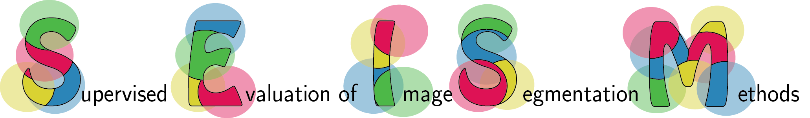

Code package that implements the image segmentation measures and reproduces all results from the papers:

**Supervised Evaluation of Image Segmentation and Object Proposal Techniques** 
Jordi Pont-Tuset and Ferran Marques, TPAMI 2015.

**Measures and Meta-Measures for the Supervised Evaluation of Image Segmentation** 
Jordi Pont-Tuset and Ferran Marques, CVPR 2013.

More info at the [project page](https://imatge.upc.edu/web/resources/supervised-evaluation-image-segmentation). 

NOTE: This code and project page will be updated very soon with the PAMI changes.
